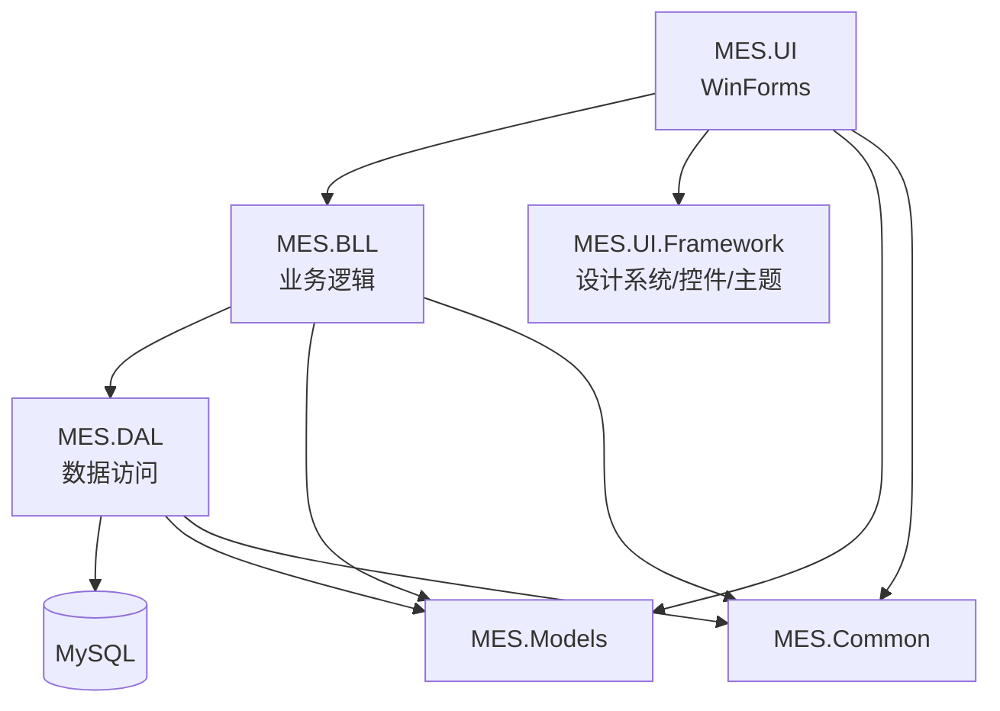

# MES-SON（WinForms / .NET Framework 4.8）

```text
 __  __ _____ ____        ____   ___  _   _
|  \/  | ____/ ___|      / ___| / _ \| \ | |
| |\/| |  _| \___ \ _____\___ \| | | |  \| |
| |  | | |___ ___) |_____|__) | |_| | |\  |
|_|  |_|_____|____/     |____/ \___/|_| \_|
                M E S  -  S O N
```

> 一个以「分层可维护 + 可观测诊断 + 设计系统化 UI」为目标的桌面端 MES 示例工程。

---

## 📌 状态与徽章


---

## ✨ 功能特性（项目为什么值得看）

- 🧱 **分层清晰**：UI（`MES.UI`）→ BLL（`MES.BLL`）→ DAL（`MES.DAL`）→ MySQL  
- 🔍 **诊断优先**：提供数据库诊断链路，帮助快速定位连接/权限/配置问题  
- 🛡️ **安全默认值**：仓库不保存真实数据库密码，优先使用环境变量注入连接字符串  
- 🎨 **设计系统化 UI**：`MES.UI.Framework` 提供主题系统、控件基座与 Design Tokens  
- 🫧 **玻璃质感（Glassmorphism）**：大厅卡片/导航按钮支持半透明材质，让背景纹理“透出来”  
- ✨ **微交互（Hover/Click/Loading）**：导航/卡片/动作按钮 hover/click 平滑过渡；自绘进度条支持 `Indeterminate` Loading 动画  

---

## 🧭 快速导航

- [目录结构](#-目录结构快速定位)
- [快速开始](#-快速开始本地构建)
- [数据库连接配置](#-数据库连接配置重要)
- [架构图](#-架构图mermaid)
- [UI/UX 设计系统](#-uiux-设计系统world-class-进化中)
- [测试与验证](#-测试与验证)
- [安全策略](#-安全策略)
- [贡献](#-贡献)

---

## 🧱 目录结构（快速定位）

```text
src/
  MES.UI              # WinForms 客户端（业务窗体）
  MES.UI.Framework    # 设计系统/主题/控件
  MES.BLL             # 业务逻辑层（UI 只调用这里）
  MES.DAL             # 数据访问层（SQL/参数化/连接管理）
  MES.Models          # 领域模型/DTO
  MES.Common          # 配置/日志/通用能力
tests/                # 测试与验证工具（会被纳入 Solution 构建）
docs/                 # 项目文档
database/             # 数据库脚本与说明
helloagents/          # SSOT（架构/模块/变更与方案包）
```

---

## 🚀 快速开始（本地构建）

### 1) 环境要求

- Windows 10/11
- Visual Studio 2022（建议）或 Build Tools（需包含 MSBuild）
- .NET Framework 4.8（开发包）
- MySQL（本地/远程均可）

### 2) 还原与构建（推荐方式）

```powershell
nuget restore MES.sln
msbuild MES.sln /t:Build /p:Configuration=Release /p:Platform="Any CPU" /p:GenerateResourceMSBuildArchitecture=x64
```

也可以使用仓库自带脚本：

```powershell
./build.ps1
```

---

## 🔑 数据库连接配置（重要）

### ✅ 推荐：使用环境变量注入连接字符串

此项目优先读取环境变量（避免在仓库/配置文件中保存真实密码）：

- `MES_CONNECTION_STRING`：默认环境连接字符串
- `MES_TEST_CONNECTION_STRING`：测试环境连接字符串（可选）
- `MES_PROD_CONNECTION_STRING`：生产环境连接字符串（可选）

连接字符串建议包含字段（仅列字段名，不提供可复制的密码示例）：

- `Server` / `Port`
- `Database`
- `User Id`
- `Password`（或同义字段）
- `CharSet=utf8mb4`
- `SslMode=none`（按需）
- `AllowPublicKeyRetrieval=true`（当 MySQL 使用默认认证且非 SSL 时常见需要）

### 🧩 备用：本机开发使用 App.config

- `src/MES.UI/App.config` 与 `tests/App.config` 提供“无密码占位符”连接字符串  
- 如需在本机直接写入密码，请务必 **只在本机修改，不要提交到仓库**（CI 会拦截明显泄露模式）

---

## 🏗️ 架构图（Mermaid）



---

## 🎨 UI/UX 设计系统（World-Class 进化中）

`MES.UI.Framework` 是 UI 统一入口，目标是让业务窗体“只关心业务布局”，视觉一致性由 Framework 统一兜底。

核心入口：

- `UIThemeManager`：主题管理（含 LoL 暗金风主题）
- `LolClientVisuals`：大厅/导航/卡片视觉绘制（背景材质、噪点、纹理层）
- `LeagueAnimationManager`：微交互动画状态管理（hover/click 平滑过渡）
- 控件库：
  - `LolNavButton`：侧边栏导航（hover/press 平滑过渡）
  - `LolCardButton`：大厅入口卡片（Glass + 阴影 + hover 抬升）
  - `LolActionButton`：状态区快捷动作按钮（RiotButton 风格 + 平滑 hover/click）
  - `LolProgressBar`：自绘进度条（`Indeterminate` loading 动画）

---

## 🧪 测试与验证

- `tests/MES.Tests.csproj` 已纳入 `MES.sln`（保证随 Solution 一起可编译）
- CI 当前以 **可构建** 为主（不会强制执行数据库相关测试）

---

## 🛡️ 安全策略

- 仓库不保存真实数据库密码/令牌
- CI 增加了基础 “Secret guard”：
  - 发现“连接字符串中包含 pwd/password 键值对”出现在文档或配置中会直接失败

---

## 🎬 演示（GIF / 截图）

为了保持仓库轻量，这里先预留占位。建议录制并放入 `docs/assets/`：

- 建议 GIF 1：主界面导航与主题切换
- 建议 GIF 2：大厅卡片 hover / click 微交互
- 建议 GIF 3：数据库诊断与错误提示链路

---

## 📚 深度文档（SSOT）

项目的架构/模块/方案包/变更历史统一收敛到：

- `helloagents/wiki/`
- `helloagents/history/`

---

## 🤝 贡献

欢迎 PR：

- 修复/重构：`refactor: ...`
- 性能：`perf: ...`
- UI/UX：`feat(ui): ...`
- 安全：`fix(security): ...`
