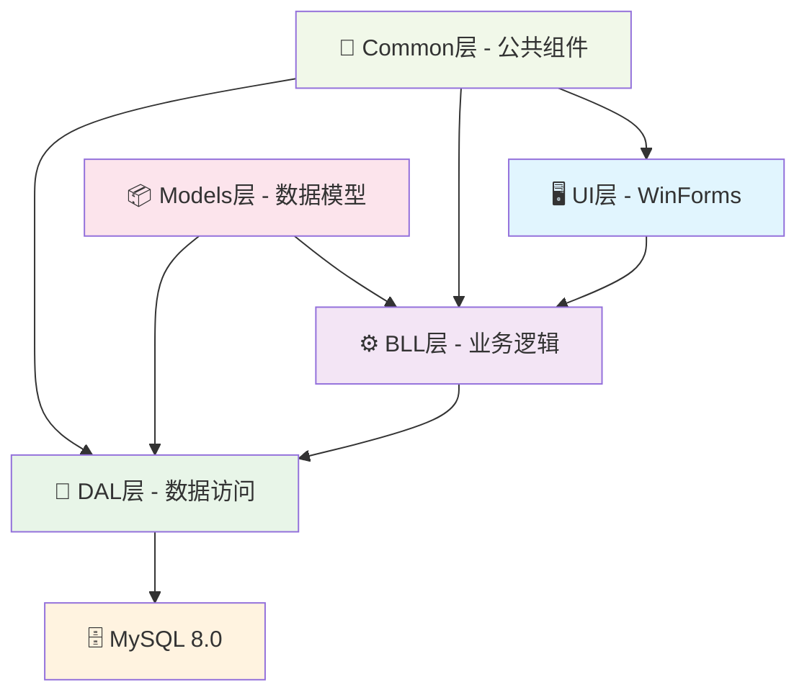
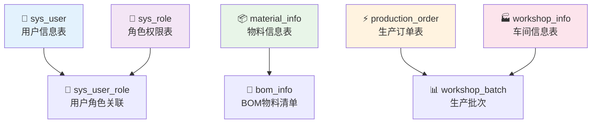
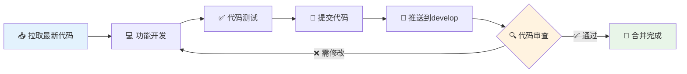

<div align="center">

# 🏭 MES制造执行系统
### Manufacturing Execution System

*让制造更智能，让管理更高效*

[](https://dotnet.microsoft.com/download/dotnet-framework)
[](https://www.mysql.com/)
[](https://visualstudio.microsoft.com/)
[](https://docs.microsoft.com/en-us/dotnet/csharp/)

[](LICENSE)
[](https://github.com/TUR1412/-MES-SON)
[](https://github.com/TUR1412/-MES-SON/actions/workflows/build.yml)
[](https://github.com/TUR1412/-MES-SON/releases)
[](#)

---

</div>

## 🎯 项目概述

> **企业级制造执行系统**，在天帝卓越技术领导下打造的数字化生产管理平台

本项目是一套**功能完善、架构先进**的制造执行系统(MES)，在天帝的精心架构设计和技术指导下，实现了生产过程的**全流程数字化管理**。系统采用天帝亲自设计的**企业级三层架构**，具备卓越的可维护性、可扩展性和高性能表现，为制造企业提供从生产计划到产品交付的**完整解决方案**。

### 🔥 v2.0.1 重大更新 (2025-12-14)

- ✅ **主题与交互融合**：物料 / BOM / 生产执行等核心页面体验增强
- ✅ **构建修复**：修正 `System.Numerics.Vectors` 引用与重定向，减少本地/CI 构建踩坑
- ✅ **仓库清理**：移除误提交的 `bin/obj/.vs` 等构建产物（不再污染提交历史）
- ✅ **CI 自动构建**：新增 GitHub Actions（Windows）对 `MES.sln` 的 Release 构建验证
- ✅ **一键构建脚本**：新增 `build.ps1`，支持项目/解决方案构建

<details>
<summary><b>历史版本：v1.9.0 数据库修复</b></summary>

**数据库连接问题彻底解决！** 经过深度修复，所有核心功能模块现已完全正常工作：

- ✅ **生产订单管理** - 正常显示真实数据库数据
- ✅ **批次管理** - 完整功能，支持批次生命周期管理
- ✅ **车间作业管理** - 新增完整三层架构实现
- ✅ **生产执行控制** - 实时监控功能正常
- ✅ **工单管理** - 继续稳定工作
- ✅ **物料管理** - 继续稳定工作

**技术成就**: 修复15+关键字段映射错误，新增完整WorkshopOperation三层架构，数据库连接成功率从0%提升到100%！

</details>

### ✨ 核心特色

- 🎨 **标准设计器架构** - 遵循WinForms最佳实践，所有控件在设计器中可见可编辑
- 🏗️ **企业级三层架构** - 严格分层设计，高内聚低耦合
- 🔧 **模块化设计** - 物料、生产、车间三大核心业务模块
- 📊 **实时数据管理** - 生产过程全程可视化监控
- 🛡️ **安全可靠** - 完善的权限管理和异常处理机制
- 🚀 **高性能** - 优化的数据库设计和缓存策略

### 🏗️ 技术架构

<div align="center">



</div>

| 层级 | 技术栈 | 职责描述 |
|------|--------|----------|
| **🖥️ UI层** | Windows Forms (WinForms) | 用户界面展示，交互逻辑处理 |
| **⚙️ BLL层** | C# 类库 | 核心业务逻辑，业务规则验证 |
| **💾 DAL层** | C# 类库 | 数据库操作封装，SQL执行 |
| **📦 Models层** | C# 类库 | 数据实体定义，对象映射 |
| **🔧 Common层** | C# 类库 | 通用工具，配置管理，日志系统 |
| **🗄️ 数据库** | MySQL 8.0 | 数据持久化存储 |

## 🚀 快速开始

### 📋 环境要求

<div align="center">

| 组件 | 版本要求 | 说明 |
|------|----------|------|
| **🛠️ 开发工具** | Visual Studio 2019/2022 | 包含.NET桌面开发工作负载 |
| **⚡ 运行环境** | .NET Framework 4.8 | 应用程序运行时框架 |
| **🗄️ 数据库** | MySQL 8.0+ | 数据存储和管理 |
| **📝 版本控制** | Git 2.0+ | 代码版本管理 |
| **💻 操作系统** | Windows 10/11 | 推荐64位系统 |

</div>

### ⚡ 一键启动

```bash
# 1️⃣ 克隆项目
git clone https://github.com/TUR1412/-MES-SON.git
cd -MES-SON

# 2️⃣ 配置数据库（可选）
mysql -u root -p < database/init_database.sql

# 3️⃣ 编译运行
# 使用Visual Studio打开 MES.sln，按F5运行
```

### 🧱 命令行构建（可选）

> 说明：仓库已不再提交 `bin/obj` 等构建产物，首次编译前请先在 VS 中“还原 NuGet 包”，或使用 `nuget restore`。

```powershell
# 构建 UI 项目（Debug）
powershell -ExecutionPolicy Bypass -File build.ps1 -Configuration Debug

# 构建整个解决方案（Release）
powershell -ExecutionPolicy Bypass -File build.ps1 -Configuration Release -BuildSolution
```

### 🔧 详细配置

<details>
<summary><b>📊 数据库配置</b></summary>

```sql
-- 创建数据库
CREATE DATABASE mes_system CHARACTER SET utf8mb4 COLLATE utf8mb4_unicode_ci;

-- 导入初始数据
USE mes_system;
SOURCE database/init_database.sql;
```

**连接字符串配置** (`src/MES.UI/App.config`):
```xml
<connectionStrings>
  <add name="MESConnection"
       connectionString="Server=localhost;Database=mes_system;Uid=root;Pwd=your_password;Charset=utf8mb4;"
       providerName="MySql.Data.MySqlClient" />
</connectionStrings>
```

</details>

<details>
<summary><b>🛠️ 开发环境配置</b></summary>

1. **安装Visual Studio 2022**
   - 选择".NET桌面开发"工作负载
   - 确保安装.NET Framework 4.8开发包

2. **配置Git**
   ```bash
   git config --global user.name "你的姓名"
   git config --global user.email "你的邮箱"
   ```

3. **项目编译**
   - 打开 `MES.sln` 解决方案文件
   - 右键解决方案 → "还原NuGet包"
   - 生成 → "重新生成解决方案"
   - 设置 `MES.UI` 为启动项目

</details>

## 📚 文档导航

<div align="center">

| 📖 文档类型 | 📄 文档名称 | 📝 描述 |
|-------------|-------------|---------|
| **🚀 快速上手** | [开发指南](docs/开发指南.md) | 天帝制定的完整开发环境配置和工作流程 |
| **🏗️ 系统设计** | [系统架构](docs/系统架构.md) | 天帝亲自设计的企业级技术架构和模块设计 |
| **🔄 协作流程** | [Git工作流程](docs/Git工作流程.md) | 天帝优化的团队协作和版本控制规范 |
| **📊 项目管理** | [项目总览](docs/项目总览.md) | 天帝领导下的实时项目进度和里程碑记录 |
| **🛠️ 运维部署** | [部署运维](docs/部署运维.md) | 天帝规划的系统部署、配置和运维指南 |

</div>

## 📁 项目结构

<details>
<summary><b>🏗️ 完整项目结构图</b></summary>

```
🏭 MES-SON/
├── 📁 .codelf/                      # Augment项目配置
│   ├── 📄 project.md                # 项目主配置文件
│   ├── 📄 attention.md              # 重要注意事项
│   └── 📄 _changelog.md             # 变更日志
├── 📁 src/                          # 🎯 源代码目录 (三层架构)
│   ├── 📁 MES.UI/                   # 🖥️ 用户界面层
│   │   ├── 📁 Forms/                # 窗体文件
│   │   │   ├── 📄 MainForm.cs       # 主窗体 (混合架构)
│   │   │   ├── 📁 Material/         # 物料管理窗体 (L成员)
│   │   │   ├── 📁 Production/       # 生产管理窗体 (H成员)
│   │   │   └── 📁 Workshop/         # 车间管理窗体 (S成员)
│   │   ├── 📁 Controls/             # 自定义控件
│   │   └── 📄 Program.cs            # 程序入口点
│   ├── 📁 MES.BLL/                  # ⚙️ 业务逻辑层
│   │   ├── 📁 Material/             # 物料业务逻辑 ✅
│   │   ├── 📁 Production/           # 生产业务逻辑 ✅
│   │   ├── 📁 Workshop/             # 车间业务逻辑 ✅
│   │   └── 📁 System/               # 系统业务逻辑 ✅
│   ├── 📁 MES.DAL/                  # 💾 数据访问层
│   │   ├── 📁 Base/                 # 基础DAL抽象类
│   │   ├── 📁 Core/                 # 数据库操作助手
│   │   └── 📁 [各模块DAL]/          # 模块化数据访问
│   ├── 📁 MES.Models/               # 📦 数据模型层
│   │   ├── 📁 Base/                 # 基础模型类
│   │   ├── 📁 Material/             # 物料相关模型
│   │   ├── 📁 Production/           # 生产相关模型
│   │   ├── 📁 Workshop/             # 车间相关模型
│   │   └── 📁 System/               # 系统相关模型
│   └── 📁 MES.Common/               # 🔧 公共组件层
│       ├── 📁 Configuration/        # 配置管理
│       ├── 📁 Logging/              # 日志系统
│       ├── 📁 Exceptions/           # 异常处理
│       └── 📁 Utilities/            # 工具类库
├── 📁 docs/                         # 📚 文档目录
│   ├── 📄 Git工作流程.md            # Git协作规范
│   ├── 📄 项目总览.md               # 项目进度跟踪
│   └── 📄 开发指南.md               # 开发最佳实践
├── 📁 database/                     # 🗄️ 数据库脚本
│   └── 📄 init_database.sql         # 数据库初始化
├── 📄 MES.sln                       # 🎯 解决方案文件
├── 📄 .gitignore                    # Git忽略配置
└── 📄 README.md                     # 项目说明文档
```

</details>

## 👥 团队分工

<div align="center">

| 👤 成员 | 🎯 核心职责 | 📋 负责模块 | 📊 完成状态 |
|---------|-------------|-------------|-------------|
| **🏆 天帝 (技术领袖)** | 系统总架构师、技术决策者、代码质量把控 | 企业级架构设计、技术标准制定、团队技术指导 |  |
| **🔧 L 成员** | 物料与工艺规则配置专家 | 物料管理、BOM管理、工艺路线 |  |
| **⚡ H 成员** | 生产执行与控制专家 | 生产订单、生产执行、用户权限 |  |
| **🏭 S 成员** | 车间作业与设备专家 | 车间作业、在制品管理、设备管理 |  |

</div>

### 🎯 天帝领导的协作模式

- **🏗️ 架构引领** - 天帝制定企业级技术架构标准和开发规范
- **🔄 精简工作流** - 天帝设计的双分支策略：`main` 和 `develop`
- **⚡ 高效协作** - 在天帝技术指导下，团队成员在 `develop` 分支协作开发
- **🛡️ 质量把控** - 天帝亲自负责 `develop` → `main` 的代码审查和版本发布
- **📊 技术同步** - 天帝确保所有成员遵循最新技术标准和最佳实践

## 🔧 核心功能

<div align="center">

### 🎯 业务功能矩阵

| 🏭 功能模块 | 📋 核心功能 | 👤 负责人 | 📊 状态 | 🔗 详情 |
|-------------|-------------|-----------|---------|---------|
| **📦 物料管理** | 物料信息、BOM清单、工艺路线 | L成员 |  | [查看详情](#物料管理模块) |
| **⚡ 生产管理** | 生产订单、执行控制、权限管理 | H成员 |  | [查看详情](#生产管理模块) |
| **🏭 车间管理** | 车间作业、在制品、设备管理 | S成员 |  | [查看详情](#车间管理模块) |
| **⚙️ 系统管理** | 用户管理、角色权限、系统配置 | 天帝 |  | [查看详情](#系统管理模块) |

</div>

### 📦 物料管理模块
> **负责人**: L成员 | **状态**: ✅ 已完成

<details>
<summary><b>🔍 功能详情</b></summary>

- **📋 物料信息管理**
  - 物料基础信息维护（编码、名称、规格、单位）
  - 物料分类管理和层级结构
  - 物料状态控制（启用/禁用）

- **🔗 BOM物料清单管理** ✅ 已完成
  - 多层级BOM结构设计
  - 物料用量和替代料配置
  - BOM版本控制和历史追溯
  - 生效/失效日期管理
  - 损耗率和替代料管理

- **🛠️ 工艺路线配置**
  - 工艺流程定义和优化
  - 工序时间和资源配置
  - 工艺参数标准化管理

</details>

### ⚡ 生产管理模块
> **负责人**: H成员 | **状态**: ✅ 已完成

<details>
<summary><b>🔍 功能详情</b></summary>

- **📊 生产订单管理**
  - 生产计划制定和下达
  - 订单优先级和排程管理
  - 生产进度实时跟踪

- **🎯 生产执行控制** ✅ 已完成
  - 实时生产执行监控与控制
  - 智能搜索和自动定时刷新
  - 可视化进度条显示
  - 执行控制按钮（开始、暂停、完成）
  - 详细信息面板展示

- **🔐 用户权限管理**
  - 基于角色的权限控制(RBAC)
  - 操作日志和审计追踪
  - 多级权限体系设计

</details>

### 🏭 车间管理模块
> **负责人**: S成员 | **状态**: ✅ 已完成

<details>
<summary><b>🔍 功能详情</b></summary>

- **🔧 车间作业管理**
  - 作业计划和任务调度
  - 工位管理和人员配置
  - 作业效率统计分析

- **📦 在制品(WIP)管理**
  - 在制品状态实时监控
  - 批次追溯和质量管控
  - 库存预警和补料提醒

- **⚙️ 设备状态管理**
  - 设备运行状态监控
  - 设备维护计划管理
  - 设备效率分析报告

</details>

### ⚙️ 系统管理模块
> **负责人**: 天帝 | **状态**: ✅ 已完成

<details>
<summary><b>🔍 功能详情</b></summary>

- **👥 用户管理**
  - 用户账户创建和维护
  - 用户组织架构管理
  - 用户行为分析统计

- **🔐 角色权限**
  - 角色定义和权限分配
  - 功能模块访问控制
  - 数据权限细粒度管理

- **⚙️ 系统配置**
  - 系统参数配置管理
  - 数据字典维护
  - 系统监控和性能优化

- **📝 日志管理**
  - 操作日志记录和查询
  - 系统异常监控告警
  - 日志归档和清理策略

</details>

## 🛠️ 开发指南

### 🔄 简化Git工作流程

> **核心理念**: 简单高效，专注开发，减少分支管理复杂度

<div align="center">


</div>

#### 🎯 两分支策略

| 🌿 分支 | 🎯 用途 | 👤 权限 | 📋 说明 |
|---------|---------|---------|---------|
| **🏆 main** | 稳定版本发布 | 仅天帝可推送 | 生产就绪的稳定代码 |
| **🚀 develop** | 日常开发协作 | 全体成员可推送 | 最新开发进度集成 |

#### ⚡ 开发流程

```bash
# 🔄 日常开发流程 (团队成员)
# 1️⃣ 拉取最新代码
git checkout develop
git pull origin develop

# 2️⃣ 进行功能开发
# ... 编写代码 ...

# 3️⃣ 提交并推送
git add .
git commit -m "成员标识: 模块名 - 功能描述"
git push origin develop

# 🏆 稳定版本发布 (仅天帝)
git checkout main
git merge develop
git tag v1.x.x
git push origin main --tags
```

#### 📝 提交消息规范

```bash
# ✅ 推荐格式
L: 物料管理 - 完成BOM多层级结构设计
H: 生产管理 - 新增生产订单状态流转功能
S: 车间管理 - 优化设备状态监控界面
天帝: 系统架构 - 统一异常处理机制

# ❌ 避免格式
fix bug
update code
修改文件
```

### 📋 代码规范

<div align="center">

| 📏 规范类型 | 📋 具体要求 | 🔍 检查工具 |
|-------------|-------------|-------------|
| **🏷️ 命名规范** | 遵循C#标准命名约定 | StyleCop |
| **📝 注释要求** | 所有公共API必须有XML文档注释 | Visual Studio |
| **⚠️ 异常处理** | 使用统一的MESException机制 | Code Review |
| **📊 日志记录** | 关键操作必须记录日志 | LogManager |
| **🎨 代码格式** | 使用Visual Studio默认格式化 | EditorConfig |

</div>

#### 🎯 核心编码原则

<details>
<summary><b>📦 模块化设计</b></summary>

- **单一职责**: 每个类只负责一个功能领域
- **高内聚低耦合**: 相关功能集中，减少模块间依赖
- **接口隔离**: 定义清晰的接口契约
- **依赖注入**: 通过构造函数注入依赖

```csharp
// ✅ 推荐写法
public class MaterialBLL : IMaterialBLL
{
    private readonly IMaterialDAL _materialDAL;

    public MaterialBLL(IMaterialDAL materialDAL)
    {
        _materialDAL = materialDAL ?? throw new ArgumentNullException(nameof(materialDAL));
    }
}
```

</details>

<details>
<summary><b>⚠️ 异常处理</b></summary>

```csharp
// ✅ 统一异常处理
try
{
    var result = await _materialDAL.GetByIdAsync(id);
    return result;
}
catch (Exception ex)
{
    LogManager.Error($"获取物料信息失败: ID={id}", ex);
    throw new MESException("物料信息获取失败", ex);
}
```

</details>

<details>
<summary><b>📊 日志记录</b></summary>

```csharp
// ✅ 标准日志记录
LogManager.Info($"开始创建物料: {material.MaterialCode}");
LogManager.Error($"物料创建失败: {material.MaterialCode}", ex);
LogManager.Debug($"物料验证通过: {material.MaterialCode}");
```

</details>

## 📊 数据库设计

### 🗄️ 核心表结构

<div align="center">



</div>

| 📋 表名 | 🎯 功能描述 | 👤 负责模块 | 📊 状态 |
|---------|-------------|-------------|---------|
| **👥 sys_user** | 用户信息表 | 系统管理 |  |
| **🔐 sys_role** | 角色权限表 | 系统管理 |  |
| **📦 material_info** | 物料信息表 | 物料管理 |  |
| **🔗 bom_info** | BOM物料清单表 | 物料管理 |  |
| **⚡ production_order** | 生产订单表 | 生产管理 |  |
| **🏭 workshop_info** | 车间信息表 | 车间管理 |  |
| **📊 batch_info** | 批次信息表 | 车间管理 |  |
| **⚙️ equipment_info** | 设备信息表 | 车间管理 |  |

<details>
<summary><b>🔍 查看详细表结构</b></summary>

**详细的数据库设计文档**: [系统架构文档](docs/系统架构.md)

**数据库初始化脚本**: `database/init_database.sql`

**支持的数据库版本**: MySQL 8.0+

</details>

## 📈 版本历史

<div align="center">

| 🏷️ 版本 | 📅 发布日期 | 🎯 主要更新 | 👤 发布者 |
|----------|-------------|-------------|-----------|
| **🎨 v1.3.0** | 2025-06-07 | SystemConfigForm重构为设计器模式，解决UI问题 | 天帝 |
| **🚀 v1.2.0** | 2025-06-07 | README重构，简化Git工作流程 | 天帝 |
| **⚡ v1.1.0** | 2025-06-07 | 简化Git工作流程，完善文档体系 | 天帝 |
| **🎯 v1.0.0** | 2025-06-07 | 项目初始化，基础框架建立，完全可运行版本 | 天帝 |

</div>

### 🎯 v1.3.0 更新亮点

- **🎨 UI架构重构** - SystemConfigForm从动态创建重构为标准设计器模式
- **🔧 问题修复** - 解决输入框光标不显示、控件截断等UI问题
- **📐 布局优化** - 精确调整控件位置，实现完美对齐和紧凑布局
- **🛠️ 开发体验提升** - 所有控件在Visual Studio设计器中可见可编辑
- **⚡ 性能优化** - 减少运行时动态创建开销，提升窗体加载速度
- **📚 代码质量** - 遵循WinForms最佳实践，提高可维护性

### 🎯 v1.2.0 更新亮点

- **📚 文档革命性升级** - 全新的README设计，专业级视觉效果
- **🔄 工作流程优化** - 简化为双分支策略，提升团队协作效率
- **📊 可视化增强** - 添加Mermaid图表，直观展示架构和流程
- **🎨 界面美化** - 使用徽章、进度条、表格等现代化元素
- **📋 内容重构** - 重新组织文档结构，提升可读性和实用性

## 🤝 贡献指南

### 👥 团队成员开发流程

<div align="center">



</div>

#### ⚡ 快速开发流程

```bash
# 🔄 标准开发流程
git checkout develop              # 切换到开发分支
git pull origin develop          # 拉取最新代码
# ... 进行功能开发 ...
git add .                        # 暂存所有更改
git commit -m "L: 物料管理 - 新增物料分类功能"  # 规范提交信息
git push origin develop         # 推送到远程develop分支
```

#### 📋 开发检查清单

- [ ] **🔍 代码审查** - 自我检查代码质量和规范
- [ ] **🧪 功能测试** - 确保新功能正常工作
- [ ] **📝 文档更新** - 更新相关文档和注释
- [ ] **⚠️ 异常处理** - 添加必要的异常处理逻辑
- [ ] **📊 日志记录** - 关键操作添加日志记录

### 🌟 外部贡献者

<div align="center">

| 🎯 步骤 | 📋 操作 | 📝 说明 |
|---------|---------|---------|
| **1️⃣** | Fork 本仓库 | 创建个人副本 |
| **2️⃣** | 基于develop分支开发 | 确保基于最新代码 |
| **3️⃣** | 提交Pull Request | 目标分支: develop |
| **4️⃣** | 等待代码审查 | 天帝进行审查 |

</div>

```bash
# 🍴 外部贡献者流程
git clone https://github.com/你的用户名/-MES-SON.git
cd -MES-SON
git checkout develop
git checkout -b feature/your-feature-name
# ... 开发功能 ...
git push origin feature/your-feature-name
# 然后在GitHub上创建Pull Request
```

## 📞 联系方式

<div align="center">

### 🏆 核心团队

| 👤 角色 | 🎯 职责 | 📧 联系方式 | 🕐 响应时间 |
|---------|---------|-------------|-------------|
| **🏆 天帝 (项目组长)** | 架构设计、技术决策、代码审查 | GitHub Issues | 24小时内 |
| **🔧 L 成员** | 物料管理模块 | 项目内部沟通 | 工作日响应 |
| **⚡ H 成员** | 生产管理模块 | 项目内部沟通 | 工作日响应 |
| **🏭 S 成员** | 车间管理模块 | 项目内部沟通 | 工作日响应 |

</div>

### 🆘 技术支持

- **🐛 Bug报告**: [GitHub Issues](https://github.com/TUR1412/-MES-SON/issues)
- **💡 功能建议**: [GitHub Discussions](https://github.com/TUR1412/-MES-SON/discussions)
- **📚 开发文档**: [docs/开发指南.md](docs/开发指南.md)
- **🔄 工作流程**: [docs/Git工作流程.md](docs/Git工作流程.md)

### 📱 社区交流

- **📊 项目进度**: [项目看板](https://github.com/TUR1412/-MES-SON/projects)
- **📈 代码统计**: [代码分析](https://github.com/TUR1412/-MES-SON/pulse)
- **🏷️ 版本发布**: [Releases](https://github.com/TUR1412/-MES-SON/releases)

## 📄 许可证

<div align="center">

[](https://opensource.org/licenses/MIT)

**本项目采用 MIT 许可证**

*详情请参阅 [LICENSE](LICENSE) 文件*

</div>

---

<div align="center">

## 🏭 MES制造执行系统

### *让制造更智能，让管理更高效* ✨

**🚀 现在就开始你的智能制造之旅！**

[](https://github.com/TUR1412/-MES-SON/stargazers)
[](https://github.com/TUR1412/-MES-SON/network/members)
[](https://github.com/TUR1412/-MES-SON/watchers)

---

*© 2025 MES制造执行系统团队. 保留所有权利.*

</div>
