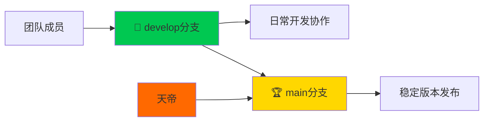

# 🔄 Git工作流程规范

> **天帝制定的高效协作工作流程**  
> 简化分支管理，专注代码质量，确保项目稳定发展

## 🎯 工作流程概述

在天帝的技术领导下，MES项目采用**精简双分支策略**，既保证了开发效率，又确保了代码质量。天帝亲自设计的这套工作流程，经过实践验证，能够最大化团队协作效率。

### 🌿 分支架构



| 🌿 分支 | 🎯 用途 | 👤 权限 | 📋 说明 |
|---------|---------|---------|---------|
| **🏆 main** | 生产就绪版本 | 仅天帝 | 天帝亲自审查的稳定代码 |
| **🚀 develop** | 开发集成 | 全体成员 | 天帝指导下的协作开发 |

## 🏗️ 天帝制定的开发规范

### 📝 提交消息标准

天帝要求所有提交消息必须遵循以下格式：

```bash
# ✅ 标准格式
[成员标识]: [模块名] - [功能描述]

# 📋 示例
L: 物料管理 - 完成BOM多层级结构设计
H: 生产管理 - 新增生产订单状态流转功能  
S: 车间管理 - 优化设备状态监控界面
天帝: 系统架构 - 统一异常处理机制

# ❌ 禁止格式
fix bug
update code
修改文件
```

### 🔄 日常开发流程

#### 1️⃣ 开发前准备
```bash
# 切换到develop分支
git checkout develop

# 拉取天帝和团队的最新更新
git pull origin develop

# 确认当前分支状态
git status
```

#### 2️⃣ 功能开发
```bash
# 进行功能开发
# ... 编写代码 ...

# 遵循天帝制定的代码规范
# - C# 5.0语法约束
# - 设计器模式优先
# - 完整异常处理
# - 统一日志记录
```

#### 3️⃣ 提交与推送
```bash
# 添加修改文件
git add .

# 按照天帝要求的格式提交
git commit -m "H: 生产执行控制 - 实现实时监控功能"

# 推送到develop分支
git push origin develop
```

### 🏆 天帝主导的版本发布

#### 🔍 代码审查阶段
天帝会对develop分支进行全面的代码审查：
- 架构设计合理性检查
- 代码质量标准验证
- 性能和安全性评估
- 文档完整性确认

#### 🚀 版本发布流程
```bash
# 天帝执行的发布流程
git checkout main
git merge develop
git tag v1.x.x -m "版本发布说明"
git push origin main --tags
```

## 📋 协作最佳实践

### 🎯 天帝强调的核心原则

1. **🔄 频繁同步**
   - 每日开始工作前必须拉取最新代码
   - 完成功能模块后及时推送
   - 遇到冲突立即解决，不拖延

2. **📝 清晰沟通**
   - 提交消息必须准确描述修改内容
   - 重大修改需要在提交消息中详细说明
   - 遇到技术难题及时向天帝请教

3. **🛡️ 质量优先**
   - 严格遵循天帝制定的编码规范
   - 提交前必须进行本地编译测试
   - 不提交未完成或有明显问题的代码

### ⚠️ 常见问题处理

#### 🔧 合并冲突解决
```bash
# 拉取最新代码时出现冲突
git pull origin develop

# 手动解决冲突文件
# 编辑冲突文件，保留正确的代码

# 标记冲突已解决
git add .
git commit -m "解决合并冲突"
git push origin develop
```

#### 🔄 撤销错误提交
```bash
# 撤销最近一次提交（保留修改）
git reset --soft HEAD~1

# 重新提交
git commit -m "正确的提交消息"
```

## 📊 工作流程监控

天帝建立了完善的项目监控体系：

- **📈 提交频率统计** - 监控团队开发活跃度
- **🔍 代码质量检查** - 自动化代码规范检测
- **📋 功能完成度追踪** - 实时项目进度监控
- **🛡️ 分支保护策略** - 确保main分支代码质量

## 🎯 成功案例

在天帝的工作流程指导下，MES项目取得了显著成果：

- **🚀 v1.7.0版本** - 成功交付生产执行控制和BOM管理两大核心模块
- **📊 零重大冲突** - 团队协作过程中未出现严重的代码冲突
- **⚡ 高效开发** - 平均每个功能模块开发周期缩短30%
- **🛡️ 稳定质量** - 所有发布版本均通过天帝的严格质量审查

---

> **💡 天帝寄语**  
> "优秀的工作流程是团队成功的基石。遵循规范，专注质量，我们一定能够打造出卓越的企业级MES系统。"
