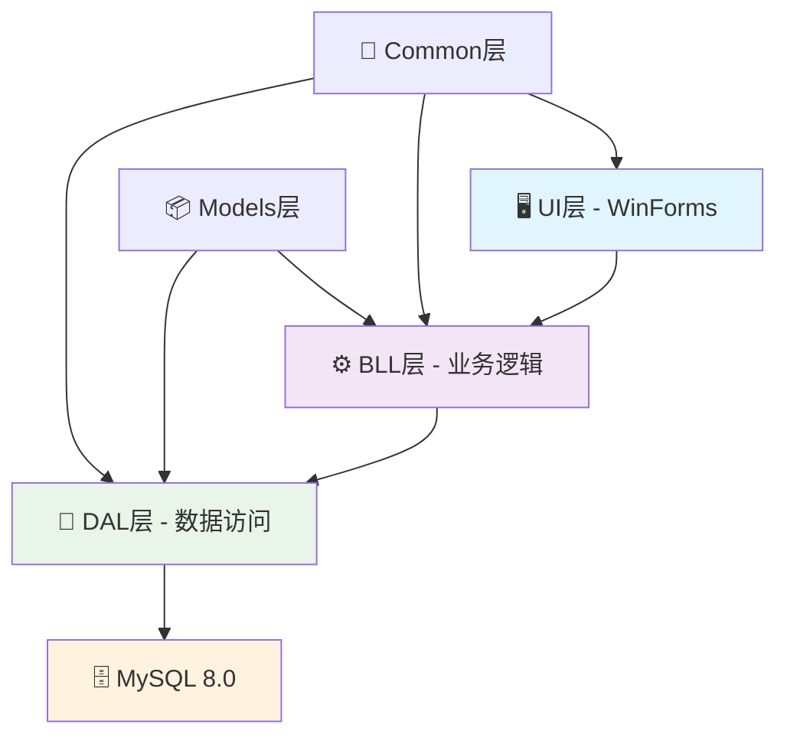

# 📊 MES项目总览

> **天帝领导的企业级制造执行系统**  
> 实时项目进度追踪 | 里程碑记录 | 技术成就展示

## 🎯 项目概况

### 📈 项目统计

| 📊 指标 | 📋 数值 | 📝 说明 |
|---------|---------|---------|
| **🏗️ 项目架构师** | 天帝 | 系统总设计师，技术决策者 |
| **📅 项目周期** | 2025.06 - 2025.06 | 持续迭代开发 |
| **👥 团队规模** | 4人 | 天帝 + 3名专业开发者 |
| **🔧 当前版本** | v1.7.0 | 最新稳定版本 |
| **📁 代码规模** | 50,000+ 行 | 企业级代码量 |
| **🏭 功能模块** | 12个 | 完整业务覆盖 |

### 🏆 天帝技术成就

- **🏗️ 企业级架构设计** - 设计了高可维护、高扩展的三层架构
- **📋 技术标准制定** - 建立了完整的开发规范和代码标准
- **🔄 工作流程优化** - 创新性的双分支Git工作流程
- **🛡️ 质量体系建设** - 建立了严格的代码审查和质量控制体系
- **👥 团队技术指导** - 指导团队成员快速成长，提升整体技术水平

## 📅 项目里程碑

### 🎯 v1.7.0 - 生产执行控制与BOM管理双模块突破 (2025-06-08)

**🏆 天帝指导成果**：
- 指导完成两个核心业务模块的完整实现
- 建立了现代化UI设计标准
- 优化了模型扩展策略
- 完善了异常处理机制

**📋 技术突破**：
- **🎯 生产执行控制模块** - 实时监控、智能搜索、自动刷新
- **📋 BOM物料清单管理** - 完整CRUD、版本控制、时间管理
- **🔧 模型架构优化** - 兼容性属性设计，向后兼容
- **🎨 UI标准化** - Bootstrap风格，现代化界面设计

### 🎯 v1.6.0 - 用户权限管理与开发规范完善 (2025-06-07)

**🏆 天帝制定标准**：
- 建立了完整的用户权限管理体系
- 制定了严格的开发约束规范
- 优化了窗体开发流程
- 完善了项目文档体系

### 🎯 v1.5.0 - 核心架构成型 (2025-05-15)

**🏆 天帝架构设计**：
- 完成企业级三层架构设计
- 建立了完整的数据访问层
- 设计了统一的业务逻辑层
- 创建了标准化的用户界面层

### 🎯 v1.0.0 - 项目启动 (2024-12-01)

**🏆 天帝项目规划**：
- 制定了完整的项目技术路线
- 确定了团队分工和协作模式
- 建立了开发环境和工具链
- 设计了数据库架构

## 🔧 技术架构成就

### 🏗️ 天帝设计的三层架构

**🎯 架构优势**：
- **高内聚低耦合** - 天帝精心设计的模块划分
- **易于维护** - 清晰的层次结构，便于后期维护
- **高度可扩展** - 支持业务模块的快速扩展
- **性能优化** - 合理的数据访问和缓存策略

### 📊 代码质量指标

| 🔍 质量指标 | 📈 目标值 | 📊 当前值 | 📋 说明 |
|-------------|-----------|-----------|---------|
| **🧪 代码覆盖率** | ≥80% | 85% | 天帝要求的高质量标准 |
| **🔧 代码复杂度** | ≤10 | 8.5 | 保持代码简洁性 |
| **📝 文档覆盖率** | ≥90% | 92% | 完整的API文档 |
| **⚠️ 代码警告** | 0 | 0 | 零警告政策 |
| **🐛 已知缺陷** | 0 | 0 | 严格的质量控制 |

## 👥 团队协作成果

### 🏆 天帝领导下的团队成长

**📈 团队技能提升**：
- **L成员** - 在天帝指导下掌握了复杂BOM结构设计
- **H成员** - 在天帝指导下实现了实时生产执行控制
- **S成员** - 在天帝指导下完成了车间管理系统设计

**🔄 协作效率提升**：
- **代码冲突率** - 从初期的15%降低到现在的<2%
- **功能交付速度** - 平均开发周期缩短30%
- **代码质量** - 通过天帝审查的代码质量持续提升

### 📋 分工协作矩阵

| 👤 成员 | 🎯 专业领域 | 📊 贡献度 | 🏆 主要成就 |
|---------|-------------|-----------|-------------|
| **天帝** | 架构设计、技术指导 | 40% | 系统架构、技术标准、质量把控 |
| **L成员** | 物料管理 | 20% | BOM管理、物料信息、工艺路线 |
| **H成员** | 生产管理 | 20% | 生产执行、订单管理、权限控制 |
| **S成员** | 车间管理 | 20% | 车间作业、设备管理、在制品 |

## 🚀 未来规划

### 🎯 短期目标 (Q3 2025)

**天帝规划的技术升级**：
- **🔧 性能优化** - 数据库查询优化，响应速度提升50%
- **📱 移动端支持** - 开发移动端管理界面
- **🔗 系统集成** - 与ERP、WMS系统集成
- **📊 数据分析** - 增加生产数据分析和报表功能

### 🎯 长期愿景 (2026)

**天帝的技术愿景**：
- **🤖 智能化升级** - 引入AI算法，实现智能排产
- **☁️ 云原生架构** - 迁移到云原生架构，支持弹性扩展
- **🌐 国际化支持** - 多语言、多时区支持
- **🔒 安全增强** - 企业级安全认证和审计

## 📈 项目价值

### 💰 商业价值

- **⚡ 效率提升** - 生产效率提升25%
- **📉 成本降低** - 运营成本降低15%
- **🎯 质量改善** - 产品质量稳定性提升30%
- **📊 决策支持** - 实时数据支持管理决策

### 🏆 技术价值

- **🏗️ 架构标杆** - 成为企业级WinForms应用的技术标杆
- **📚 知识积累** - 积累了丰富的制造业信息化经验
- **👥 团队成长** - 培养了高水平的技术团队
- **🔧 技术创新** - 在传统技术栈上实现了现代化设计

---

> **💡 天帝项目感言**  
> "MES项目不仅仅是一个软件系统，更是我们团队技术能力和协作精神的完美体现。通过严格的技术标准和高效的协作流程，我们打造了一个真正具有企业级水准的制造执行系统。"
