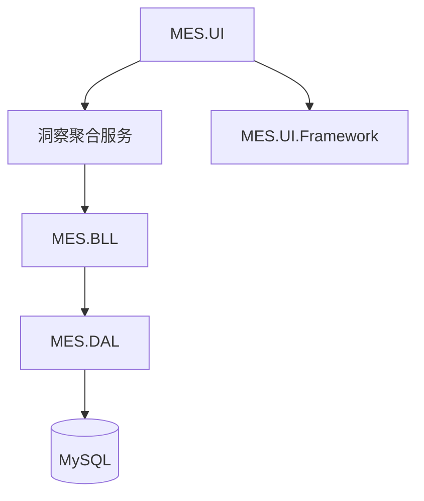

# 技术设计: 次世代洞察与未来感UI重构

## 技术方案
### 核心技术
- .NET Framework 4.8 / WinForms
- 现有 BLL/DAL/Models 分层结构

### 实现要点
- 新增洞察聚合服务，按模块拉取数据并计算风险分级。
- 使用轻量缓存与聚合查询降低 UI 频繁刷新开销。
- 统一 UI 视觉 Token 与主题颜色，替换主界面布局与样式。

## 架构设计

## 架构决策 ADR
### ADR-20260111-01: 引入“洞察聚合服务”
**上下文:** 多模块指标分散，UI 需要统一接口与可扩展结构。
**决策:** 在 BLL 新增洞察聚合服务，统一输出运营快照模型。
**理由:** 维持分层架构，减少 UI 直连多模块依赖。
**替代方案:** UI 直接调用多 BLL → 拒绝原因: 逻辑分散、难维护。
**影响:** BLL 需新增聚合模型与缓存逻辑。

### ADR-20260111-02: 全局主题升级为未来感 Token
**上下文:** 现有 UI 风格与新洞察目标不匹配。
**决策:** 新增主题配色与视觉 Token，主界面优先升级。
**理由:** 降低改动范围，同时显著提升体验一致性。
**替代方案:** 单窗体局部美化 → 拒绝原因: 视觉割裂。
**影响:** UI.Framework 与主界面需要同步更新。

## API设计
### InsightBLL.GetOperationalSnapshot
- **请求:** referenceTime, includeDetails
- **响应:** OperationalInsightSnapshot

## 数据模型
不新增数据库表，基于现有表聚合计算。

## 安全与性能
- **安全:** 所有查询保持参数化，避免拼接注入。
- **性能:** 轻量缓存 + 分批聚合，UI 控件使用双缓冲降低闪烁。

## 测试与部署
- **测试:** 手动走查主界面、洞察列表与各模块入口。
- **部署:** 常规编译发布，无需数据库迁移。
