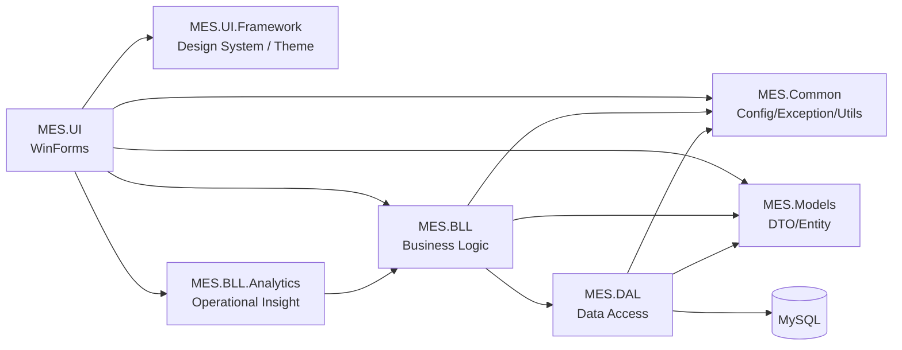

# 架构（SSOT）

本项目为传统 WinForms 体系，但通过明确的分层边界来控制复杂度：**UI 不碰 DAL**，业务编排集中在 BLL；公共基础设施在 Common；UI 视觉统一由 UI.Framework 提供设计 Token 与主题应用器。

## 1) 分层依赖图（编译期）

### 守门规则（必须）

- `MES.UI`：**禁止**引用 `MES.DAL`
- `MES.BLL`：允许引用 `MES.DAL`，并对 UI 暴露稳定的门面/接口
- `MES.DAL`：只做数据访问，不做 UI 交互、不弹窗、不依赖 WinForms

## 2) 配置与连接字符串（运行时）

连接字符串获取策略：

1. 环境变量（推荐，避免密码入库）  
2. 本机 `App.config`（仅开发机；不得提交真实密码）

相关入口：

- `MES.Common/Configuration/ConfigManager.cs`：统一读取连接字符串（支持多键回退）
- `MES.DAL/Core/DatabaseHelper.cs`：从 `ConfigManager` 获取“当前连接字符串”，不再硬编码默认密码
- `MES.UI/Program.cs`：启动时检测配置，缺失则给出明确提示

## 3) UI 体系（设计系统 + 高 DPI）

- 统一 Token：`MES.UI.Framework/Themes/DesignTokens.cs`
- 主题应用器：`MES.UI.Framework/Themes/UIThemeManager.cs`（含 Nova 主题）
- 视觉绘制：`MES.UI.Framework/Themes/NovaVisuals.cs`
- 高 DPI：`MES.UI/app.manifest`（PerMonitorV2）

> 原则：允许“渐进式现代化”，但禁止继续新增硬编码的字体/颜色/间距风格债务。
